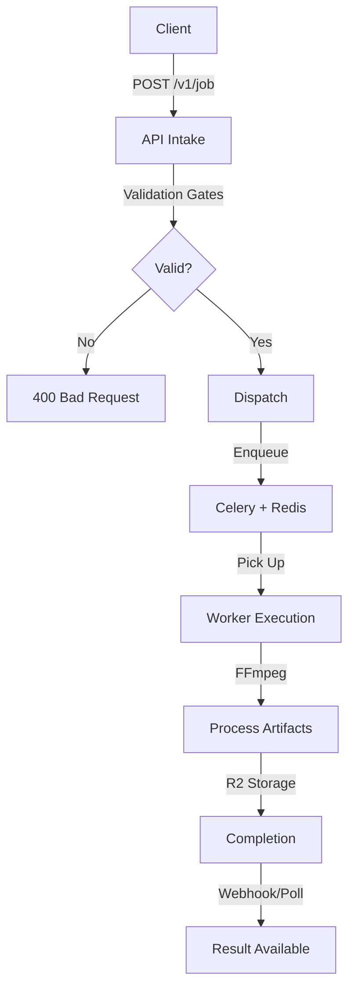

# Request Lifecycle

Flume is managed media processing infrastructure surfaced through a clean REST API. This document outlines how a request flows through the system.

## Lifecycle Flow

### 1. Intake
Every request passes through five sequential validation gates:
- **Schema:** Request body well-formed.
- **Registry:** Operations exist in the registry.
- **Params:** Parameters match definitions.
- **Type Compatibility:** Adjacent steps have matching input/output types.
- **Pipeline Spec:** Enriched spec built for execution.

### 2. Dispatch
The job is persisted and its ID is published to the task queue. The API returns immediately to the client.

### 3. Execution Loop
Workers walk the pipeline spec, fetching artifacts from R2, processing them with FFmpeg, and writing results back to storage.

### 4. Completion
Final outputs are processed (e.g., generating presigned links) and the job is marked `completed`.
