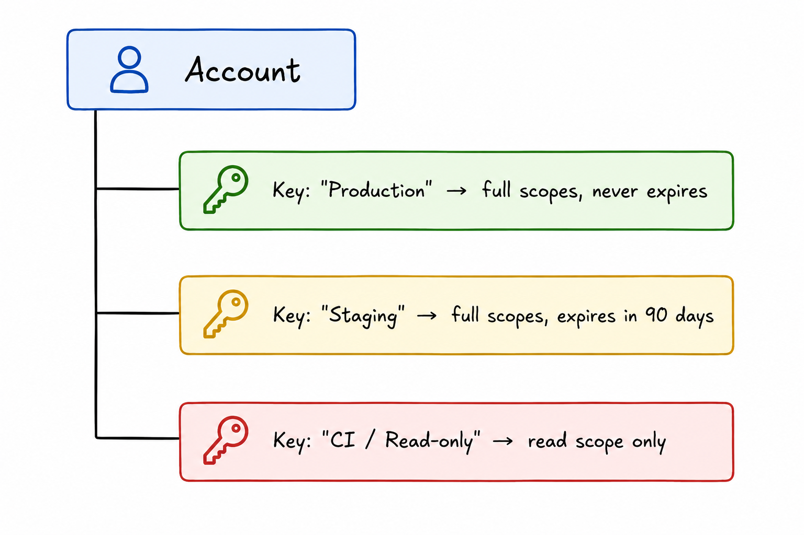
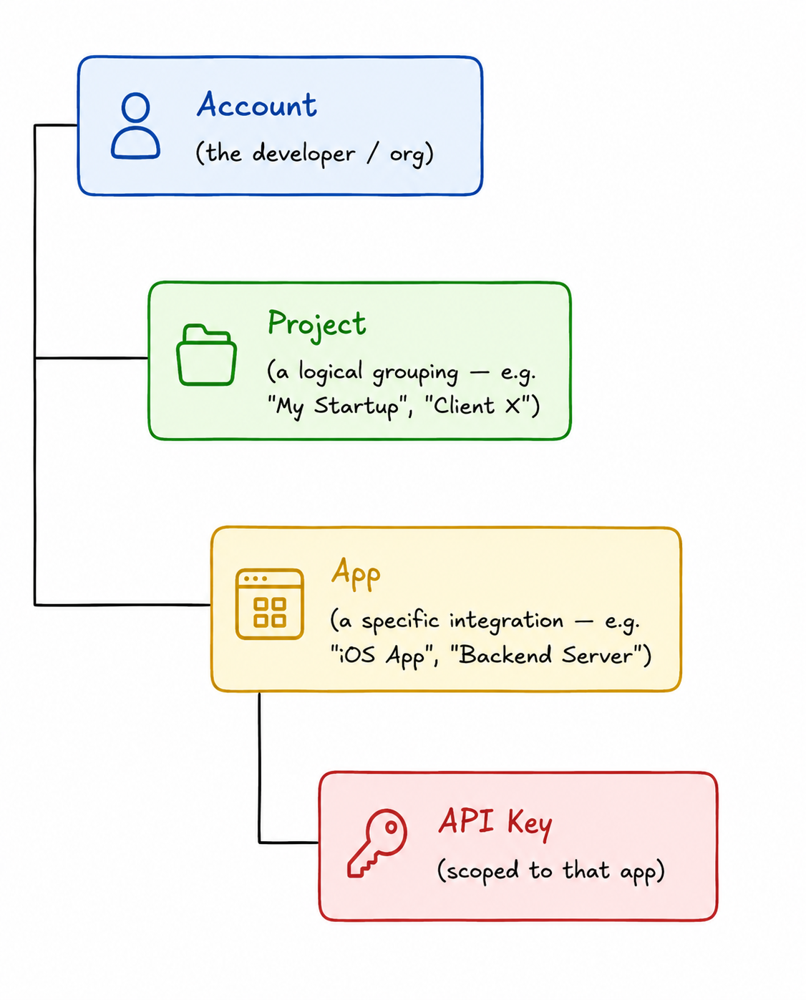

# ADR 002 — API Key Hierarchy: 2-Tier vs Resource Hierarchy

**Status:**
Accepted

**Date:**
2026-05-20

**Context:** Need an API key model that scales from free to pro tiers while keeping the implementation simple. The key question is whether to use a flat 2-tier pattern (account → keys) or a multi-level hierarchy.

---

## Decision

Use a 2-tier hierarchy: one account, multiple keys tied to it.

Each key has: name, scopes, expiry, status, last_used. Revoke one key, the others keep working.

## Considered Options

- **2-tier (account → keys)** — Simple, one account holds multiple keys. Easy to implement, easy to reason about. Scales well for entitlement gating (free: 2 keys, pro: 5 keys).

- **Resource hierarchy (org → project → app → key)** — Multi-level pattern used by Stripe, GCP. Each developer gets isolation between their own apps/projects. More complex to build.

  

## Tradeoffs

**Why 2-tier:**
- We're not multi-tenant — devs don't need per-app key isolation
- Simpler to implement and maintain
- Easy to migrate to resource hierarchy later if the need arises
- Entitlement-based limits (keys per account) map naturally to this model

**What was accepted:**
- If a developer has multiple apps, all use the same pool of keys
- No native isolation between a developer's staging/production environments at the key level

## Consequences

### Positive
- Simple data model, fast to ship
- Entitlement gating is straightforward — just count keys per account

### Negative
- Power users with multiple apps may outgrow this model

### Risks Mitigated
- Avoids over-engineering an org/project hierarchy we don't currently need

### Risks Accepted
- May need to migrate to resource hierarchy if we attract developers with complex multi-app setups

---

## Four Questions

| Question | Answer |
|---|---|
| What breaks if I get this wrong? | If we choose a model that's too simple, power users outgrow it and we do a painful migration. If we choose one too complex, we ship late with unnecessary abstraction. |
| What did I choose and what did I reject? | Chose 2-tier for speed and simplicity; rejected resource hierarchy as premature. |
| How do I know it's working? | Key creation/revocation is fast, the dashboard is simple, and no user has asked for per-app key separation yet. |
| What assumptions am I making that could be wrong? | That our developers won't need per-app isolation in the near term. If they do, we migrate. |
