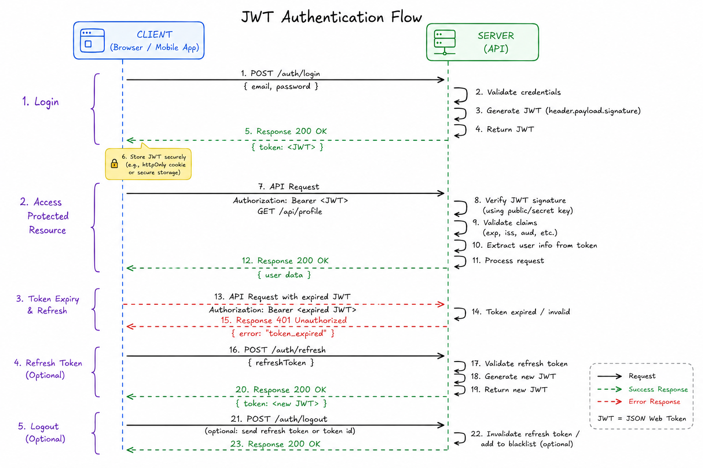
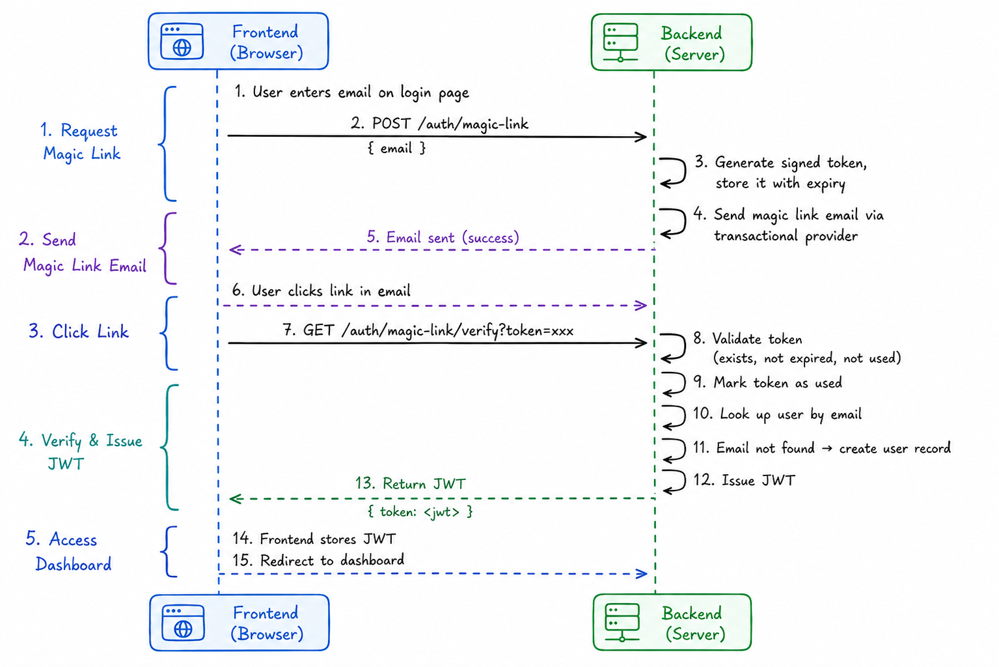
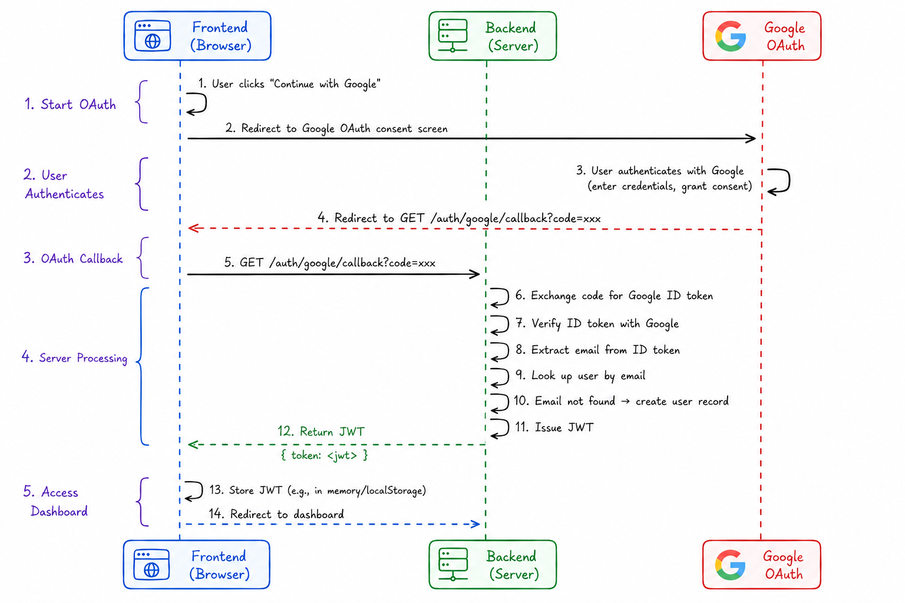
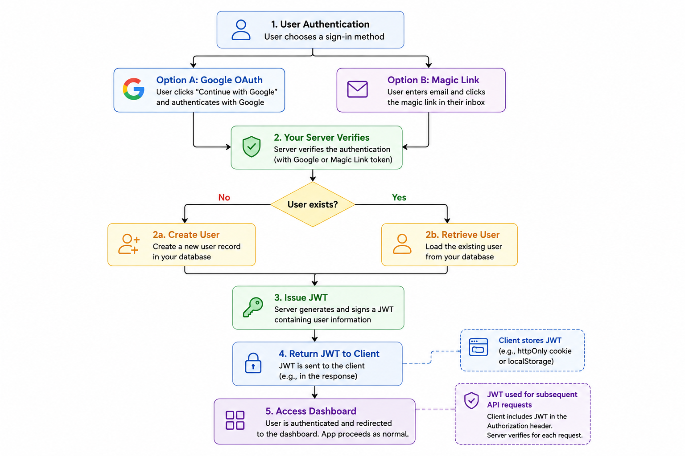

# Dashboard Authentication

This document covers the auth decisions for the web dashboard (where users create and revoke their API keys).

We use a **JWT auth model** as the base layer.

On top of this layer, we went passwordless using **Google OAuth** and **Magic Link**.

## Magic Link

User enters email → generate a short-lived signed token → email them a link → they click it → verify the token → issue JWT.

Fits well because our users are developers — they're comfortable with this pattern and likely already use it elsewhere.

### Tradeoff

**Deliverability.** You need a transactional email provider (Resend, Postmark, SendGrid) with proper SPF/DKIM set up, or magic links go to spam and you get support noise.

## Google OAuth

Standard OAuth 2.0 code flow → exchange code for Google ID token → verify it server-side → extract email/profile → issue JWT.

The main value for FlumeAPI: developers often use their work Google account, so it removes a friction point entirely. You don't store passwords or manage credentials — Google handles identity.

## Identity Model

We treat **email as the canonical identity** — magic link and Google OAuth that return the same email merge into one account.

- Email exists in DB → 200, issue JWT
- Email doesn't exist → create account, issue JWT

No pre-existing account required. First successful auth (via either method) is account creation. The email is the identity — the auth method is just how they proved they own it.

This keeps the users table clean too: one row per email, regardless of whether they came in through magic link or Google OAuth.

## Reasons for our decision

- **Developers are the users** — they're authenticating to manage API keys, monitor usage, billing. Not a daily-use app. Passwords for infrequent access = "forgot password" flow constantly.
- **No password storage risk** — you never hold a hashed password. If your DB leaks, there's no credential to crack.
- **Fewer moving parts** — no password reset flow, no "confirm password" UI, no complexity rules to enforce.
- **Google OAuth covers the SSO expectation** — B2B developer tools are expected to support Google login. Developers don't want a new password for every API dashboard they use.
