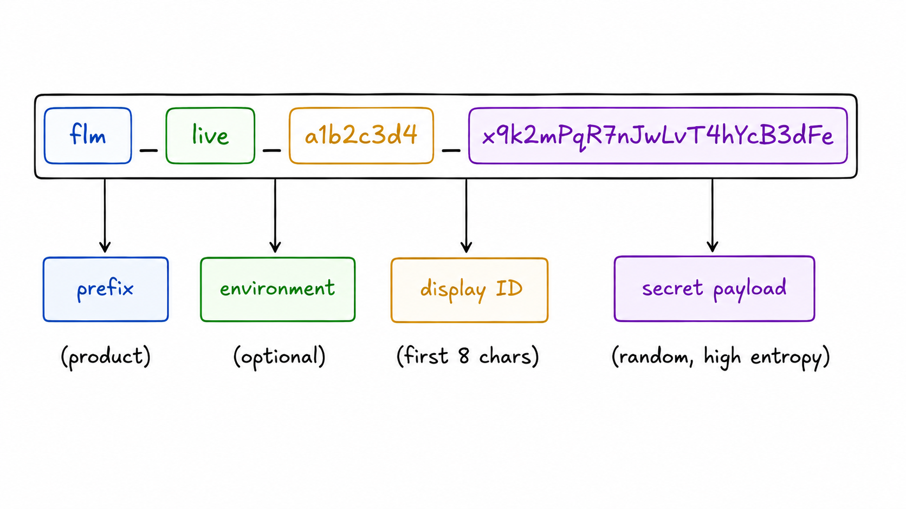
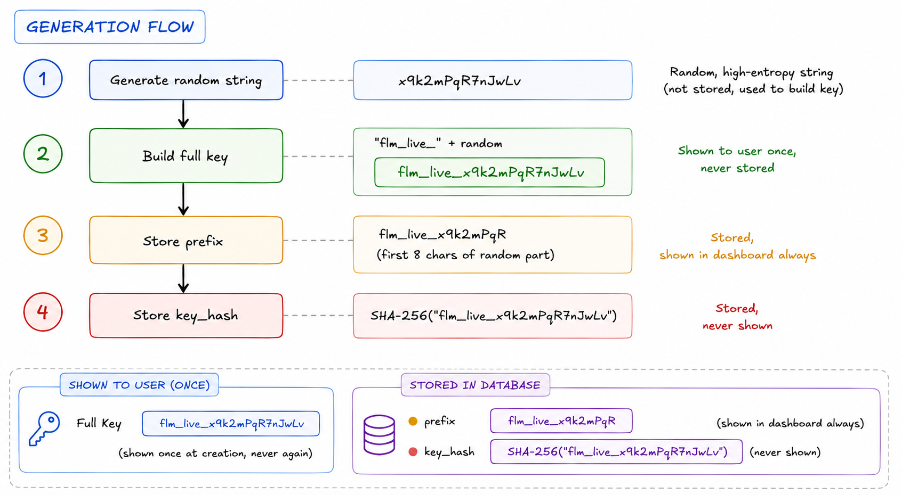
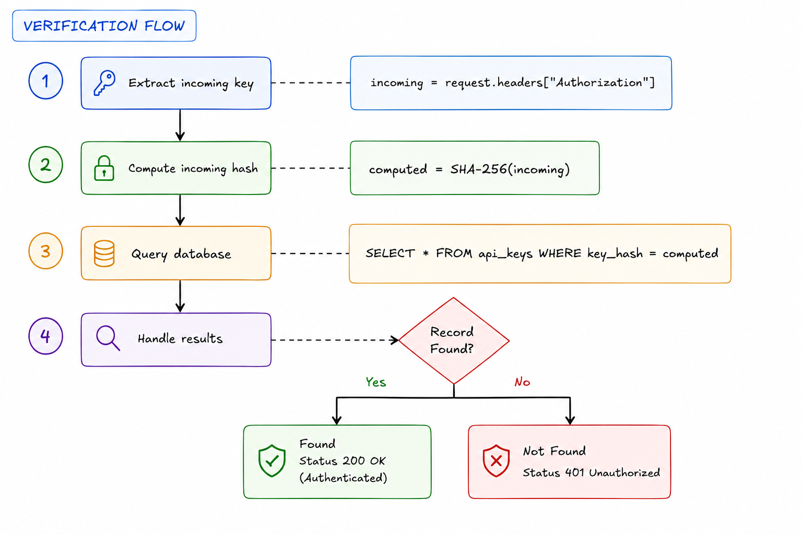
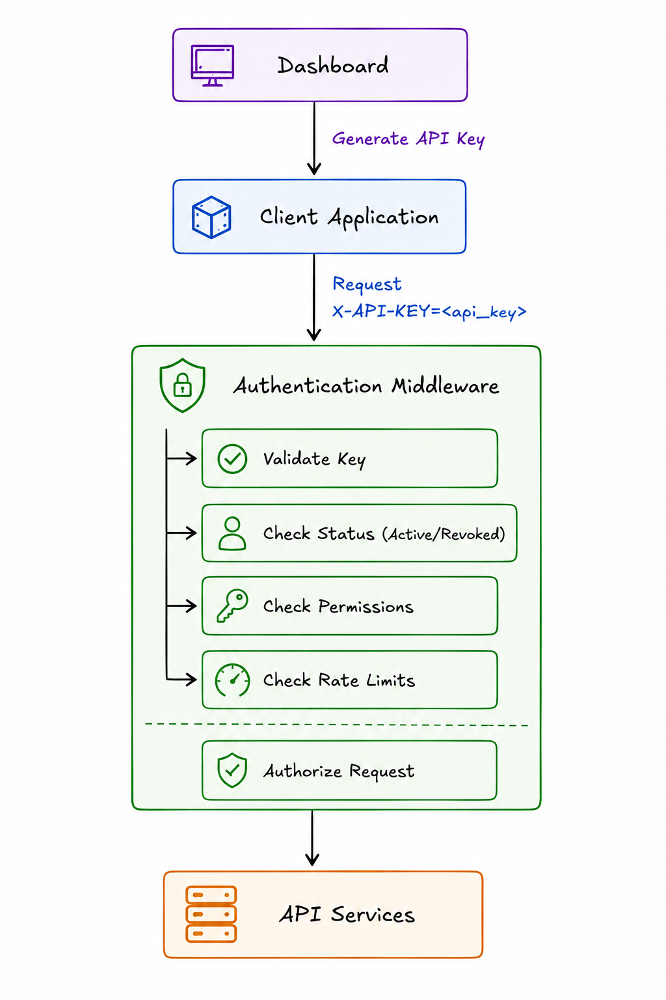

# API Key Authentication

This document covers the API key model and Auth flow — key structure, generation, hashing strategy, and request verification flow.

---

## Key Structure

A typical API key looks like this:



### Parts

**Prefix (`flm_`):**
Identifies the product. Makes the key recognizable in logs, code, and accidental commits. GitHub secret scanning uses this — if you register your prefix, GitHub alerts users who accidentally push it.

**Environment (`live_` / `test_`):**
Optional but useful. Lets you reject test keys in production at the routing layer before any DB lookup.

**Display ID (`a1b2c3d4`):**
First 8 chars of the secret payload. Stored as prefix in the DB. Never enough to reconstruct the full key — purely for the user to identify which key is which in the dashboard ("ending in a1b2c3d4").

**Secret payload (`x9k2mPqR7nJwLvT4hYcB3dFe`):**
Cryptographically random. This is what gets hashed and stored. 32 bytes (256 bits) minimum — generated via `secrets.token_urlsafe(32)`.

---

## Key Model

| Field | Type | Description |
|-------|------|-------------|
| `id` | UUID | Primary key |
| `account_id` | UUID FK | Owner account |
| `name` | varchar | Human label set by developer |
| `key_hash` | varchar(64) | SHA-256 hash of the full key |
| `key_prefix` | varchar(16) | First 8 chars for identification in dashboard |
| `scopes` | jsonb | Permissions granted to this key |
| `expires_at` | timestamptz | Optional TTL |
| `status` | enum | `active` / `revoked` |
| `last_used_at` | timestamptz | Updated on each successful auth |
| `created_at` | timestamptz | Creation timestamp |

---

## Key Generation Flow

1. Generate cryptographically random payload: `x9k2mPqR7nJwLvT4hYcB3dFe` (32 bytes, `secrets.token_urlsafe(32)`)
2. Build full key: `flm_live_x9k2mPqR7nJwLvT4hYcB3dFe` — shown to user once, never stored
3. Extract prefix: `flm_live_x9k2mPqR` — first 8 chars, stored in `key_prefix`, shown in dashboard
4. Hash the full key: `SHA-256("flm_live_x9k2mPqR7nJwLvT4hYcB3dFe")` — stored in `key_hash`, never shown

**The raw key never touches your DB after the moment of creation.**



---

## Request Verification Flow

1. **Extract** incoming key from header: `incoming = request.headers["Authorization"]`
2. **Hash** the incoming key: `computed = SHA-256(incoming)`
3. **Query** the database: `SELECT * FROM api_keys WHERE key_hash = computed`
4. **Check** status and expiry: must be `active` and not expired
5. **Handle** results:

| Result | Response |
|--------|----------|
| Found + active + not expired | `200 OK` — Authenticated |
| Not found / revoked / expired | `401 Unauthorized` |

**Why this works:** SHA-256 is deterministic — the exact same full key string always produces the exact same hash value. No plaintext keys are ever stored.



---

## Hashing Strategy

- **Algorithm:** SHA-256
- **Only the hash is stored** — the raw key is discarded after creation
- **Key prefix** is stored separately for identification (dashboard display, log correlation) but is never sufficient to reconstruct the full key

---

## Middleware Pipeline

On every authenticated request:

```
Request → Extract X-API-Key → SHA-256 → Lookup key_hash → Check status/expiry → Resolve scopes → Attach to request
```

The raw key never touches your DB after the moment of creation.

High level diagram of auth flow

