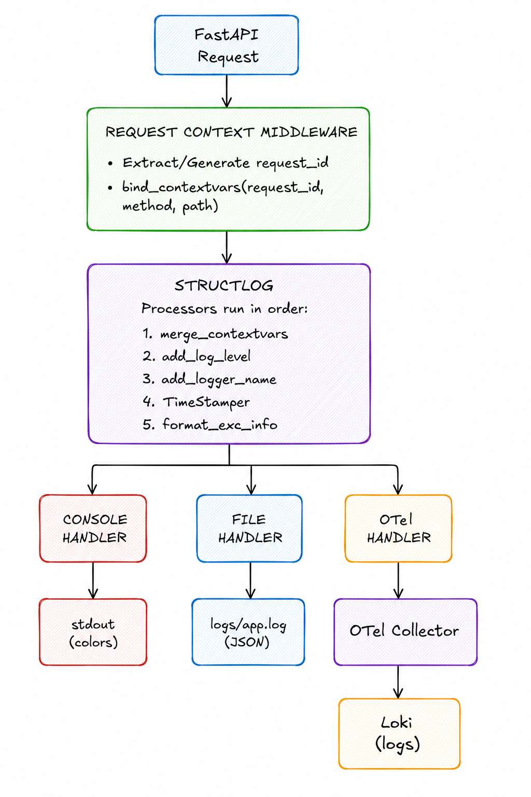
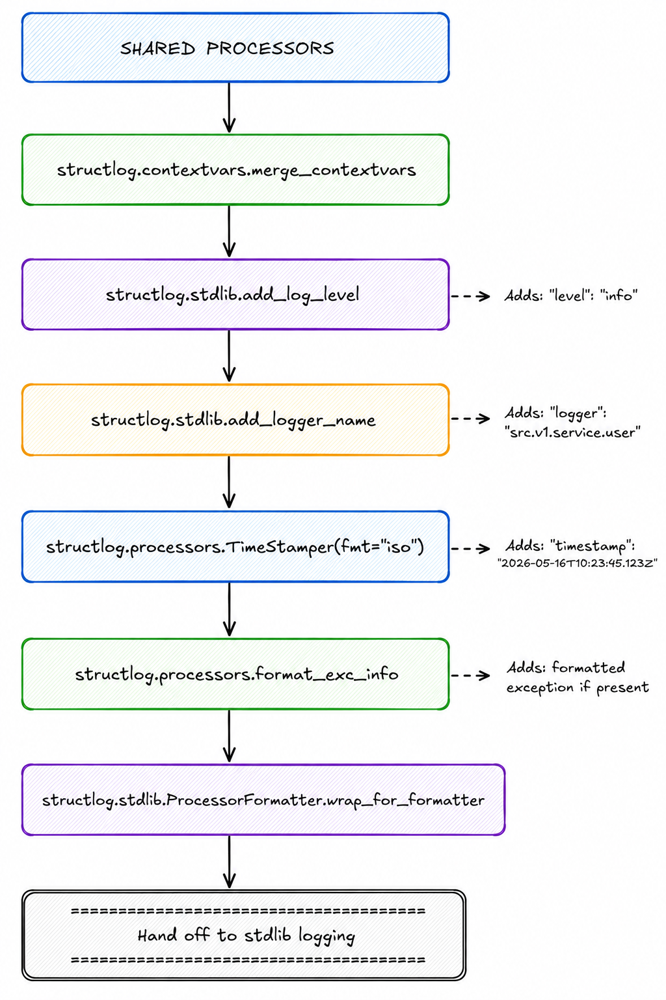
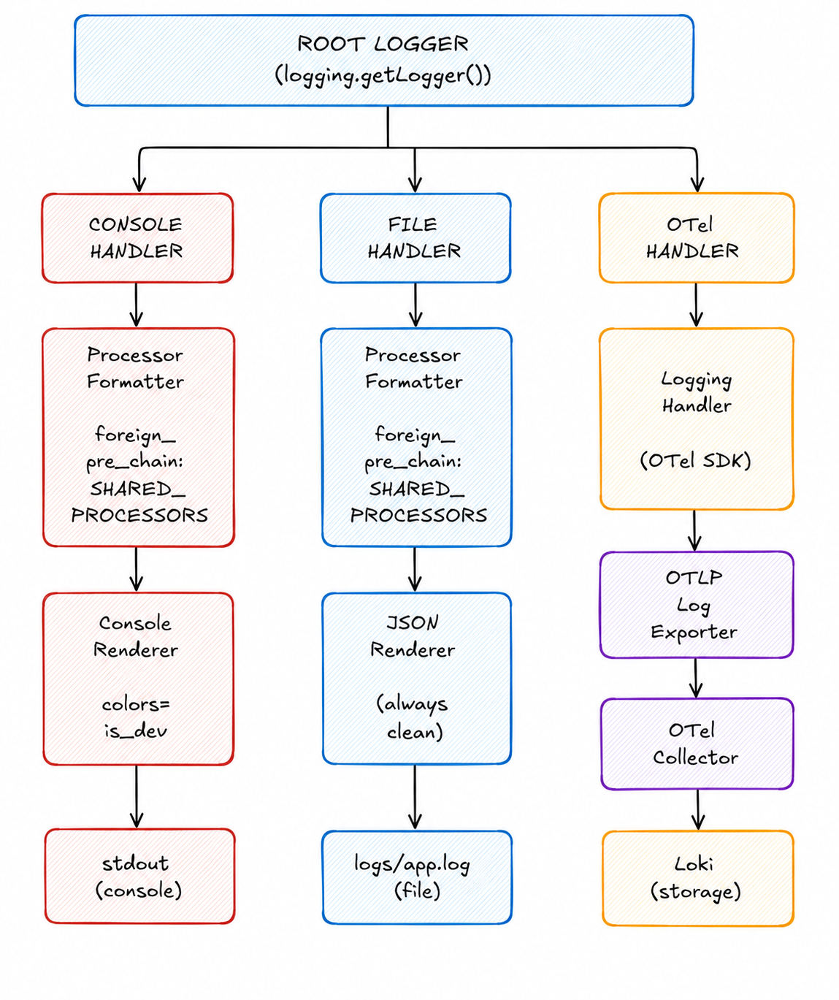
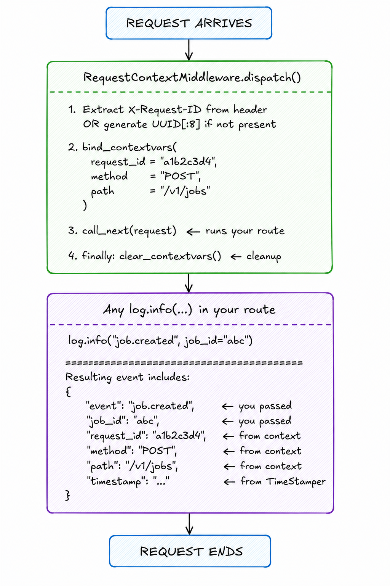
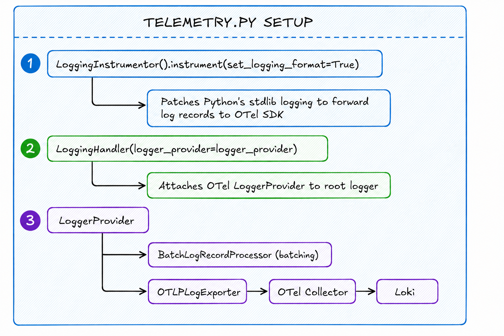
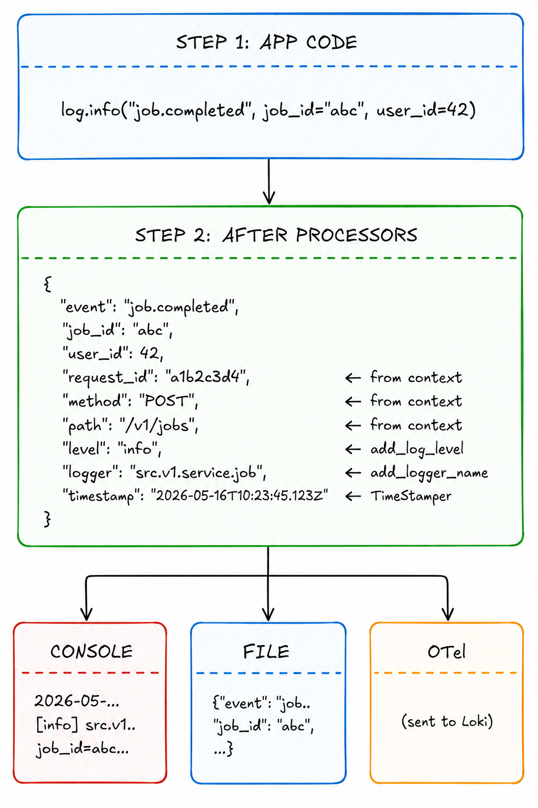

# Flume Logging Architecture

This document explains how logging works in Flume — from your app code to Console, File, and Loki.

---

## 1. High-Level Overview


---

## 2. Structlog Processors

These run **before** rendering — they add metadata to every log event.


---

## 3. Handler Pipeline (Parallel Outputs)

Each handler runs independently. All three receive the same processed event.


---

## 4. Context Flow (Per-Request)

How request-scoped variables get injected into every log.



---

## 5. Dev vs Prod Mode

| Setting | Dev | Prod |
|---------|-----|------|
| `config.app_env` | `"dev"` | `"prod"` |
| Log level | `DEBUG` | `INFO` |
| ConsoleRenderer colors | `True` (colored) | `False` (plain) |
| File output | JSON | JSON (always clean) |
| uvicorn.access | `WARNING` | `WARNING` |
| httpx | `WARNING` | `WARNING` |

**Console output (dev):**
```
2026-05-16T10:23:45.123Z [info] src.v1.service.user user.created user_id=42 request_id=a1b2c3d4
```

**Console output (prod):**
```
2026-05-16T10:23:45.123Z [info] src.v1.service.user user.created user_id=42 request_id=a1b2c3d4
```

**File output (always JSON):**
```json
{"event":"user.created","user_id":42,"request_id":"a1b2c3d4","method":"POST","path":"/api/v1/users","level":"info","logger":"src.v1.service.user","timestamp":"2026-05-16T10:23:45.123Z"}
```

---

## 6. OTel Integration

How structlog logs also flow to Loki via OpenTelemetry.


RESULT: Every structlog log goes to TWO places:
  • Console + File (via structlog handlers)
  • Loki (via OTel bridge)


---

## 7. Event Transformation Example

Step-by-step transformation of a log event.


---

## Summary

| Layer | Purpose |
|-------|---------|
| **Middleware** | Injects request_id, method, path into context |
| **Processors** | Adds level, logger name, timestamp to every event |
| **Handlers** | Three parallel outputs: console, file, OTel |
| **OTel Bridge** | Sends structlog to Loki for centralized search |
| **Dev/Prod** | Controls log level and console colors |