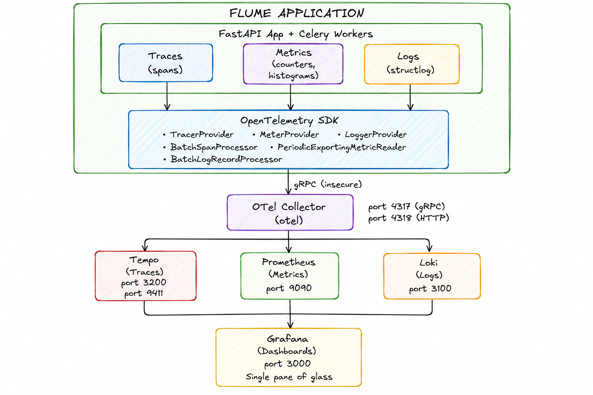
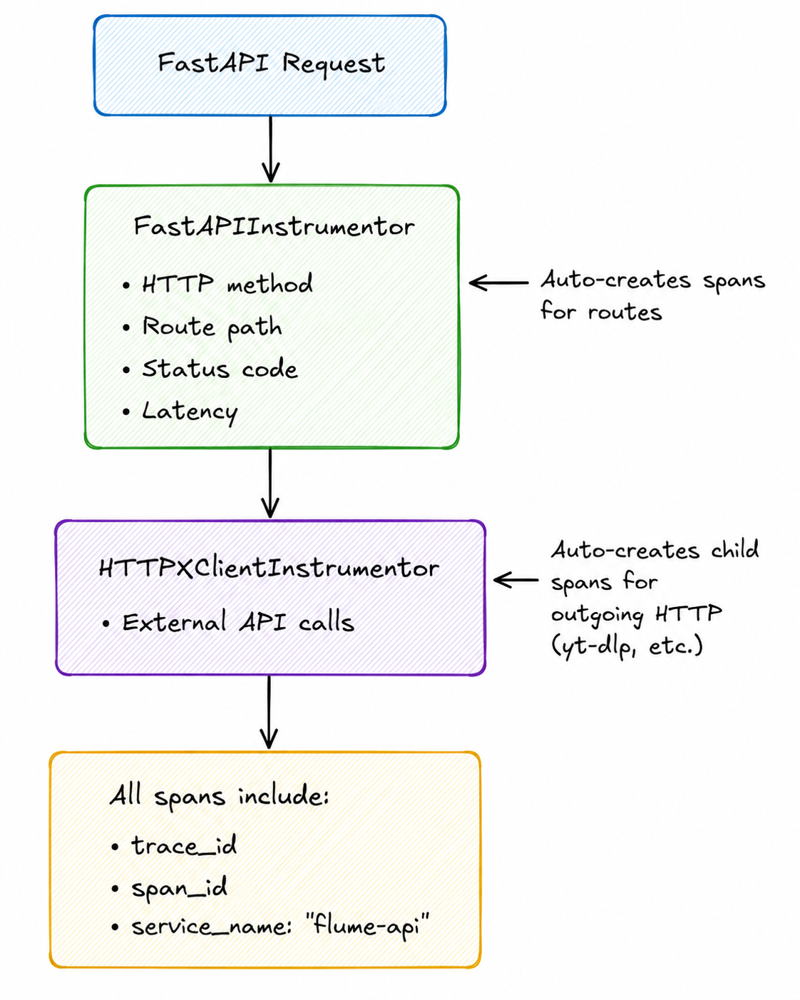

# Flume Observability Architecture

## High-Level Diagram

---

## Signal Flow

| Signal | Source | Exporter | Destination | Purpose |
|--------|--------|----------|--------------|---------|
| **Traces** | FastAPI routes, httpx calls | `OTLPSpanExporter` → BatchSpanProcessor | Tempo | Request flow, latency, debugging |
| **Metrics** | App code (counters/histograms) | `OTLPMetricExporter` → PeriodicExportingMetricReader | Prometheus | Request counts, latency buckets, custom metrics |
| **Logs** | structlog + stdlib logging | `OTLPLogExporter` → BatchLogRecordProcessor | Loki | Application logs with trace correlation |

---

## Key Components

| Component | Technology | Port | Role |
|-----------|------------|------|------|
| **Collector** | OTel Collector Contrib | 4317/4318 | Receives all signals, routes to backends |
| **Traces** | Grafana Tempo | 3200 | Distributed trace storage |
| **Metrics** | Prometheus | 9090 | Time-series metrics DB |
| **Logs** | Grafana Loki | 3100 | Log aggregation |
| **Dashboards** | Grafana | 3000 | Unified UI for all three signals |

---

## Auto-Instrumentation

---

## Context Correlation

All three signals are correlated via:
- **`trace_id`** — links logs to traces
- **`span_id`** — links logs to specific spans
- **`service_name`** — filters by service in Grafana