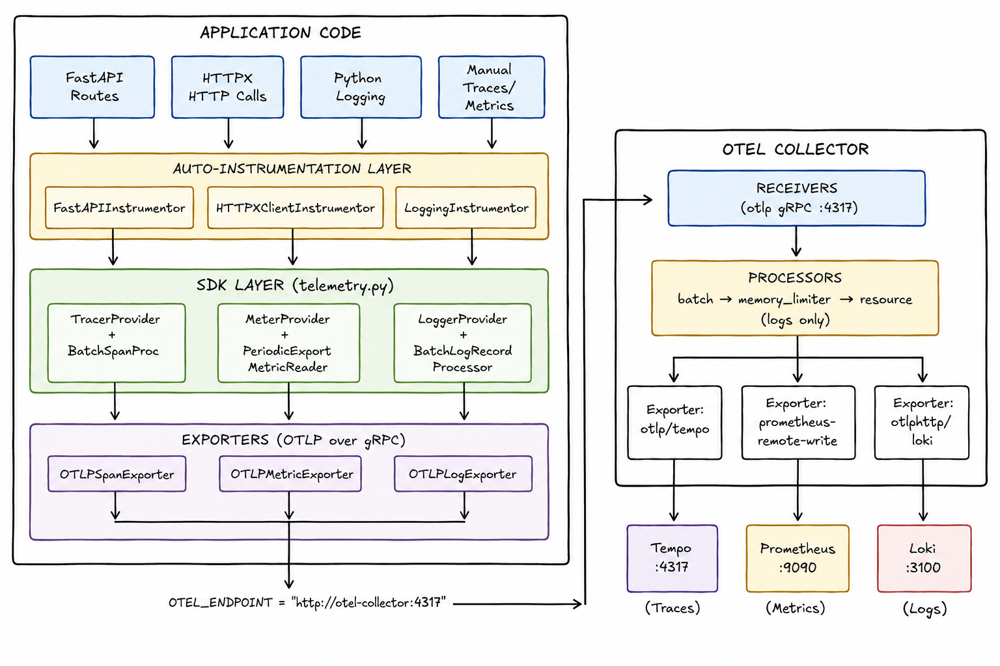

# Observability Flow

## High-Level Flow

```
App Code → Auto-Instrumentors → OTel SDK (telemetry.py) → OTel Collector → Backends
```

## 1. Telemetry.py - OTel SDK Setup

**Location:** `backend/src/utils/telemetry.py`

The `setup_telemetry()` function is the central bootstrap function that initializes all three OTel signals (traces, metrics, logs). Here's what it does:

### Resource Creation

Creates a `Resource` that tags all telemetry with the service name (`flume-api`). This metadata identifies all data coming from this service in Grafana/Tempo/Loki.

```python
resource = Resource.create({SERVICE_NAME: service_name})
```

### Traces Setup

```python
tracer_provider = TracerProvider(resource=resource)
tracer_provider.add_span_processor(
    BatchSpanProcessor(
        OTLPSpanExporter(endpoint=OTEL_ENDPOINT, insecure=True)
    )
)
trace.set_tracer_provider(tracer_provider)
```

- `TracerProvider`: Manages all trace spans in the application
- `BatchSpanProcessor`: Buffers spans in memory and sends them in batches (better throughput)
- `OTLPSpanExporter`: Sends spans to the OTel Collector via gRPC
- Global registration: Makes `trace.get_tracer(__name__)` available anywhere

### Metrics Setup

```python
metric_reader = PeriodicExportingMetricReader(
    OTLPMetricExporter(endpoint=OTEL_ENDPOINT, insecure=True)
)
meter_provider = MeterProvider(resource=resource, metric_readers=[metric_reader])
metrics.set_meter_provider(meter_provider)
```

- `PeriodicExportingMetricReader`: Collects metrics on a 60-second interval and exports
- `MeterProvider`: Manages all metric instruments (counters, histograms, gauges)
- `OTLPMetricExporter`: Sends metrics to collector via gRPC

### Logs Setup

```python
logger_provider = LoggerProvider(resource=resource)
logger_provider.add_log_record_processor(
    BatchLogRecordProcessor(
        OTLPLogExporter(endpoint=OTEL_ENDPOINT, insecure=True)
    )
)
set_logger_provider(logger_provider)

LoggingInstrumentor().instrument(set_logging_format=True)
handler = LoggingHandler(logger_provider=logger_provider)
logging.getLogger().addHandler(handler)
```

- `LoggerProvider`: Manages all log records
- `BatchLogRecordProcessor`: Buffers logs and exports in batches
- `OTLPLogExporter`: Sends logs to collector via gRPC
- `LoggingInstrumentor`: Patches Python's standard logging module to forward logs to OTel pipeline
- `LoggingHandler`: Attaches the OTel provider to the root logger

### Auto-Instrumentation

```python
if app is not None:
    FastAPIInstrumentor.instrument_app(app)
HTTPXClientInstrumentor().instrument()
```

- `FastAPIInstrumentor`: Wraps every FastAPI route handler in a span automatically
- `HTTPXClientInstrumentor`: Wraps every outgoing httpx request in a child span

### OTel Endpoint Configuration

```python
OTEL_ENDPOINT = "http://otel-collector:4317"
```

Points to the OTel Collector running in Docker. Uses gRPC on port 4317.

## 2. Instrumentation Modules

The codebase uses automatic (zero-code) instrumentation through OTel's instrumentors:

| Instrumentor | Package | What it does |
|---|---|---|
| `FastAPIInstrumentor` | `opentelemetry.instrumentation.fastapi` | Wraps every FastAPI route handler in a span automatically. Captures HTTP method, route path, status code, and latency. |
| `HTTPXClientInstrumentor` | `opentelemetry.instrumentation.httpx` | Wraps every outgoing HTTP request in a child span. Critical for tracing calls to external services. |
| `LoggingInstrumentor` | `opentelemetry.instrumentation.logging` | Patches Python's standard logging module to forward all log records to the OTel logging pipeline. |

There is currently no manual instrumentation in the codebase (no `trace.get_tracer()` or `metrics.get_meter()` calls outside of the setup function), meaning all telemetry is generated automatically through the auto-instrumentors.

## 3. Stack Configuration

### docker-compose.yml

**Location:** `docker-compose.yml`

The stack defines an observability network with these services:

| Service | Image | Purpose |
|---|---|---|
| `otel-collector` | `otel/opentelemetry-collector-contrib:latest` | Central collection point for all telemetry |
| `prometheus` | `prom/prometheus:v2.51.0` | Metrics storage and querying |
| `tempo` | `grafana/tempo:2.4.1` | Distributed tracing backend |
| `loki` | `grafana/loki:3.0.0` | Log aggregation |
| `grafana` | `grafana/grafana:10.4.2` | Visualization UI |

The backend service depends on `otel-collector` and connects to the observability network.

### OTel Collector Configuration

**Location:** `backend/observability/otel-collector.yaml`

The collector acts as a middleware that receives, processes, and exports telemetry:

- **Receivers:** OTLP protocol on gRPC (port 4317) and HTTP (port 4318)
- **Processors:**
  - `batch`: Buffers and batches data
  - `memory_limiter`: Prevents OOM
  - `resource`: Adds `environment="development"` attribute
- **Exporters:**
  - Traces → `otlp/tempo` → Tempo (port 4317)
  - Metrics → `prometheusremotewrite` → Prometheus (HTTP endpoint)
  - Logs → `otlphttp/loki` → Loki (HTTP port 3100)

## 4. Complete Data Flow



## 5. Flow Steps Explained

### Step 1: Application Startup

- `main.py` calls `setup_telemetry(app)` at line 60
- Creates the Resource with service name `"flume-api"`
- Initializes `TracerProvider`, `MeterProvider`, `LoggerProvider`
- Exports to OTel Collector at `http://otel-collector:4317`
- Auto-instruments FastAPI and HTTPX

### Step 2: Request Handling (Traces)

1. Request arrives at FastAPI route
2. `FastAPIInstrumentor` automatically creates a span wrapping the handler
3. Span captures: HTTP method, path, status code, duration
4. Span sent to `TracerProvider` → `BatchSpanProcessor` → `OTLPSpanExporter`
5. Exporter sends to OTel Collector via gRPC

### Step 3: Outgoing HTTP Calls (Traces)

1. If application makes HTTP calls via httpx
2. `HTTPXClientInstrumentor` automatically wraps each request in a child span
3. Child span linked to parent request span via trace context
4. Sent through the same trace pipeline

### Step 4: Logging

1. Application code calls `logger.info(...)` (via structlog)
2. `LoggingInstrumentor` intercepts the log call
3. Log record includes `trace_id` and `span_id` (if in request context)
4. Log sent to `LoggerProvider` → `BatchLogRecordProcessor` → `OTLPLogExporter`
5. Exporter sends to OTel Collector

### Step 5: Metrics

1. Auto-instrumentation automatically generates metrics: HTTP request count, latency histograms, active connections, etc.
2. `PeriodicExportingMetricReader` collects every 60 seconds
3. Metrics sent to `MeterProvider` → `OTLPMetricExporter`
4. Exporter sends to OTel Collector

### Step 6: OTel Collector Processing

1. Collector receives all three signal types via OTLP receiver
2. Processors batch, limit memory, add attributes
3. Exporters forward to backends: Traces → Tempo, Metrics → Prometheus, Logs → Loki

### Step 7: Visualization

- Grafana queries Tempo for traces
- Grafana queries Prometheus for metrics
- Grafana queries Loki for logs
- All correlated via `trace_id`/`span_id`

## 6. Key Integration Points

| Component | Integration | File |
|---|---|---|
| FastAPI | Auto-instrumented via `FastAPIInstrumentor` | `telemetry.py:106-107` |
| Logging | structlog + OTel `LoggingHandler` + `LoggingInstrumentor` | `log.py:84`, `telemetry.py:96-98` |
| HTTPX | Auto-instrumented via `HTTPXClientInstrumentor` | `telemetry.py:112` |
| OTel Collector | Docker service dependency, gRPC endpoint | `docker-compose.yml:171-193` |
| Tempo | Exported via OTLP from collector | `otel-collector.yaml:24-27` |
| Prometheus | Metrics exported via remote-write | `otel-collector.yaml:29-32` |
| Loki | Logs exported via HTTP OTLP | `otel-collector.yaml:34-37` |

## Summary

The telemetry system uses OpenTelemetry's automatic instrumentation to capture traces, metrics, and logs with zero manual code changes. The flow is:

1. **Instrumentation:** Auto-patches FastAPI, httpx, and Python logging
2. **SDK:** Collects and batches telemetry via providers
3. **Export:** Sends OTLP data to OTel Collector over gRPC
4. **Processing:** Collector batches, processes, and routes to backends
5. **Storage:** Tempo (traces), Prometheus (metrics), Loki (logs)
6. **Visualization:** Grafana provides unified dashboards

The entire system is configured via `telemetry.py` for the app side and `otel-collector.yaml` for the collection/processing side, with all services orchestrated through Docker Compose.

