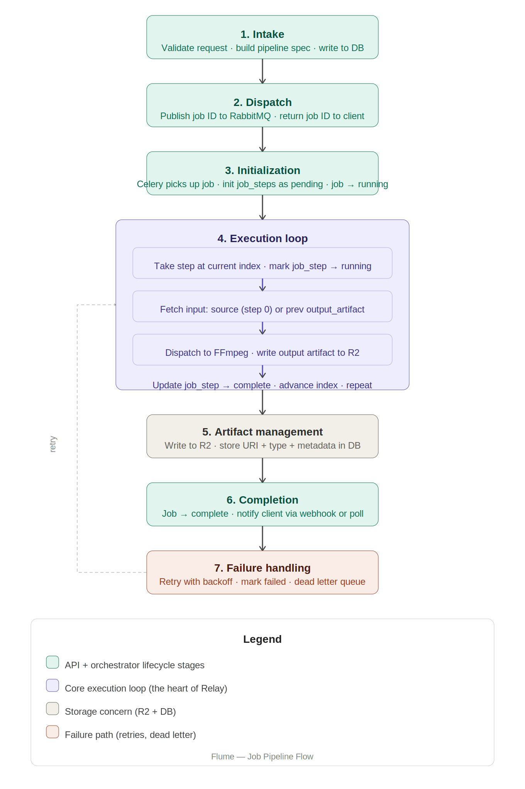

# Workflow Orchestrator Pipeline

The orchestrator is the control plane of the architecture. It receives validated job requests, walks them through a sequence of operations, and produces final artifacts. In its simplest form it's a job queue combined with a state machine.

## Glossary

| Term | Definition |
|------|------------|
| **Job** | An end-to-end operation — from submission to final artifact |
| **Submission time** | Everything that happens when the client sends `POST /jobs`. The request is still being handled by the API. No worker has started. Errors caught here are cheap — no compute spent. |
| **Runtime** | Everything that happens after the job is handed to the orchestrator. The worker is running, FFmpeg is processing, artifacts are being written. Errors here are expensive — you're mid-job. |
| **Artifact** | A file a step produces, stored in R2, with metadata describing what it is |
| **Step artifact** | The artifact a specific step produced. Lives in `job_steps.output_artifact`. |
| **Typed artifact** | An artifact with a type — `video`, `audio`, `image`, `gif` |
| **Intermediate artifact** | An artifact produced mid-pipeline, consumed by the next step, not the final output |
| **Final artifact** | The artifact the last step produces. Delivered to the client. |

## Tables

Three tables own the pipeline state:

| Table | Role |
|-------|------|
| `jobs` | The plan and execution owner — stores the pipeline spec inline alongside the job lifecycle |
| `job_steps` | The execution record — initialized as pending, updated by the orchestrator as each step runs |

One `jobs` row owns N `job_steps` rows — one per operation in the pipeline.

Analogy: `jobs` is the recipe, `job_steps` is the cooking log. The recipe says "trim, then compress, then extract audio." The log says "trim started at 10:00, finished at 10:03, produced this file. Compress started at 10:03..."

## Type System

Four types: `video`, `audio`, `image`, `gif`. Every artifact has one of these types. Every operation declares what it accepts and what it produces. The type system is what catches invalid pipelines at submission time — if step N produces `audio` and step N+1 only accepts `video`, the mismatch is caught before any processing runs.

Terminal operations produce a type that nothing downstream can consume. Nothing can follow a terminal step.

## Pipeline Spec

Flume uses a **linear pipeline model** — a predefined, sequential flow (A → B → C). The alternative (DAG/graph model) supports conditional branching, but the linear model is simpler and sufficient for V1. The trade-off: all operation flow must be predefined; there's no runtime branching.

The pipeline spec is the intermediary representation (IR):

- The job submission (JSON body) is the source code
- Validation and type-checking across steps is semantic analysis
- The artifact flowing between steps is the IR — machine-agnostic, a typed reference to data
- Each operation (trim, compress, extract) is a transformation pass on that artifact
- The final output is the machine code

The key insight from compilers: optimize and validate at the IR level, not at the source level. For Flume, that means catching type mismatches at submission time, before any compute runs.

## 7 Components

### 1. Intake

API validation, operation registry check, pipeline spec construction. Input is the raw request body. Output is a valid pipeline spec written to DB.

The [operation registry](operation-registry.md) is an internal config defining how operations are structured and how they flow. Flume's API is declarative — users define what they want, not how. Being strict with the registry removes ambiguity in the operation flow.

**Categories drive validation logic:**

| Category | Behavior |
|----------|----------|
| **Transformative** | Pipeline continues. One input, one output. |
| **Combinatory** | Pipeline continues. Needs multiple inputs in params. |
| **Terminal** | Pipeline must end here. Nothing can follow. |

Error messages are registry-aware: unknown operation — says exactly that; bad params — names the offending param and why.

#### Validation Philosophy: Operation-Level vs Phase-Level

Two approaches to validating pipeline order:

**Phase-Level (rejected):** Operations grouped into strict chronological phases — sourcing → cutting → transformation → enrichment → export. Steps must follow this order.

- `watermark` → `trim` ✗ Rejected (can't go backward)
- `trim` → `watermark` → `resize` ✗ Rejected (`resize` can't follow `watermark`)

Problem: too rigid. No technical reason you can't watermark before resizing.

**Operation-Level (chosen):** No phases. The registry enforces order strictly by checking type compatibility between adjacent steps. At each boundary, one question: *does the output type of step N match the input type of step N+1?*

- `trim (video → video) → resize (video → video)` ✓
- `trim (video → video) → extract_audio (video → audio [terminal])` ✓
- `extract_audio → trim` ✗ Nothing follows a terminal
- `trim → watermark → resize` ✓ All types match, order irrelevant

Operation-level focuses on the only constraint that matters: **data compatibility**. If one tool's output can safely feed the next tool's input, the pipeline is valid. This maximizes flexibility while guaranteeing correctness.

#### Intake Validation Gates

All validation runs at submission time in `src/service/validation.py`. Six sequential gates — if any fails, the request is rejected with a clear `BadRequest`. Nothing proceeds to the next gate until the current one passes.

| Gate | What it checks | Implementation |
|------|----------------|----------------|
| **1 — Schema** | Request body well-formed, `source` is a valid URL via Pydantic `HttpUrl`, `pipeline` is non-empty | Pydantic `CreateJobRequest` |
| **2 — Registry** | Every operation name in `pipeline` exists in the operation registry | `validate_registry()` |
| **3 — Params** | Required params present, types match registry, enum values within allowed set, int/float within min/max bounds, no unknown params | `validate_params()` |
| **4 — Type compatibility** | Source type matches step 0's input types; each step's output type matches the next step's input types (operation-level type matching) | `validate_type_compatibility()` |
| **5 — Terminal position** | Terminal operations (`extract_audio`, `thumbnail`, `gif`) only at the last pipeline position | `validate_terminal_position()` |
| **6 — Pipeline spec** | All gates passed — build enriched spec annotated with category, input_types, output_type for downstream consumers | `build_pipeline_spec()` |

**Error model:** Every gate raises `BadRequest` with a positional message identifying exactly what failed and where. Errors at submission time are cheap — no compute spent.

#### Source Pre-Resolution

Before intake validation runs, the route resolves the source URI. If the
URI corresponds to an unattached upload (from `POST /uploads`), the route
marks it as attached. This prevents the cleanup job from deleting the file
mid-pipeline.

After this step the source is a plain URI — external URLs and uploads
follow the exact same path through validation. Intake never touches upload
logic.

### 2. Dispatch

Publish the job ID to RabbitMQ, return the response to the client. Intake hands off to dispatch. This is the boundary between the API and the orchestrator.

### 3. Initialization

Celery worker picks up the job ID, reads the pipeline spec, initializes all `job_steps` as pending, marks the job as running. Sets up the execution context before any processing begins.

### 4. Execution Loop

The core — walks steps by index, fetches input, dispatches to FFmpeg, writes artifact to R2, updates step state, advances cursor.

### 5. Artifact Management

Writing to R2, reading from R2, structuring artifact metadata. The execution loop calls into this, but it's a distinct concern.

### 6. Completion

All steps done — mark job complete, trigger client notification via webhook or make the result available for polling.

### 7. Failure Handling

Step fails — retry logic, mark failed, dead letter, stop pipeline. Cuts across the execution loop but deserves its own treatment.

## Design Notes

**Partial failure model:** Each step is independent. Step B can fail without affecting A or C. It does not kill the entire job. Each step's artifact lives in ephemeral durable storage (R2), available to be picked up by the next step or delivered as final output.
